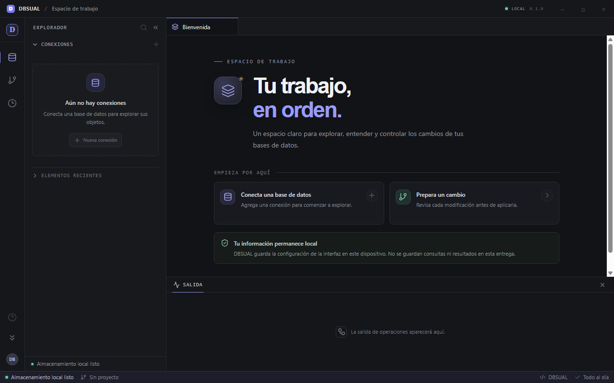

<div align="center">

# DBSUAL

### Tu espacio de trabajo para bases de datos

Conecta, explora y consulta distintos motores desde una aplicación de escritorio clara, segura y extensible.

[](https://github.com/Alejooc/BDSUAL/actions/workflows/ci.yml)
[](LICENSE)
[](#plataformas)

</div>

<p align="center">
  
</p>

## Una sola aplicación para tu trabajo con datos

DBSUAL es un **gestor de bases de datos de escritorio** pensado para reunir conexiones, exploración y consultas SQL en un mismo espacio de trabajo. Su interfaz toma ideas de los entornos de desarrollo modernos: navegación lateral, pestañas y herramientas que puedes tener a mano mientras trabajas.

El objetivo es **Windows, macOS y Linux** con una experiencia coherente. Hoy Windows es la única plataforma con aplicación nativa y paquetes comprobados. Hay configuración de compilación inicial para macOS/Linux, pero no hay todavía paquetes ni recorridos nativos validados para uso.

## Lo que puedes hacer

| | Capacidad |
|---|---|
| 🔌 | Guardar conexiones a MySQL, MariaDB y PostgreSQL, o abrir archivos SQLite existentes. |
| 🧭 | Explorar bases, esquemas, tablas, vistas y columnas, según el motor. |
| 🧮 | Consultar con `SELECT` y revisar datos en cuadrículas con lectura paginada donde está disponible. |
| 🔐 | Proteger contraseñas de conexión con el almacén seguro del sistema operativo (Windows actualmente). |
| 🧾 | Revisar un historial local y usar recuperación parcial en algunos recorridos MySQL y MariaDB. |

### Compatibilidad actual

| Motor | Conexión y exploración | Consultas y datos | Escrituras y recuperación |
|---|---|---|---|
| **MySQL** | Conexión directa o SSH; catálogo de bases y objetos | `SELECT` y cuadrícula paginada | Algunas operaciones acotadas con revisión e historial; cobertura parcial |
| **MariaDB** | Conexión directa o SSH; catálogo de bases y objetos | `SELECT` y cuadrícula paginada | Recuperación parcial; la cuadrícula permanece de solo lectura |
| **PostgreSQL** | Conexión directa; catálogo agrupado por esquema | `SELECT` y cuadrícula de solo lectura | Solo lectura |
| **SQLite** | Archivos existentes en modo de solo lectura | `SELECT` y cuadrícula de solo lectura | Solo lectura |

Las capacidades varían según el motor y continúan en validación. DBSUAL no sustituye una estrategia de respaldo verificada; revisa el destino y el alcance antes de confirmar una operación.

## Plataformas

**Objetivo del producto:** Windows, macOS y Linux. **Estado actual:** Windows es la única plataforma con recorrido y paquetes comprobados. La selección inicial de backends de credenciales y checks de compilación macOS/Linux están configurados, pero aún falta ejecutarlos, probar instalación y completar recorridos nativos. No se ofrecen paquetes listos para macOS o Linux. Ver [spec 019](specs/019-plataformas.md).

## Empezar en Windows

### Requisitos

- Windows 10/11 x64 y WebView2 Runtime.
- Node.js 24 (versión fijada en [`.nvmrc`](.nvmrc)).
- Rust 1.98 con toolchain MSVC.
- Visual Studio Build Tools y Windows SDK.

### Ejecutar en modo desarrollo

```powershell
npm ci
npx playwright install chromium
npm run tauri dev
```

### Compilar y comprobar

```powershell
npm run build
npm run test:unit
npm run test:e2e
cargo fmt --manifest-path src-tauri/Cargo.toml --all -- --check
cargo test --manifest-path src-tauri/Cargo.toml --locked
```

La [integración continua](.github/workflows/ci.yml) ejecuta la suite y genera instaladores MSI/NSIS en Windows; además tiene checks de build para macOS y Linux aún pendientes de validar en CI. Los paquetes Windows son de prueba y no están firmados para publicación.

`npm run test:e2e` compila el frontend y ejecuta Playwright contra el preview de producción en un puerto local dedicado. Los recorridos E2E simulan IPC y no reemplazan la verificación en la ventana Tauri nativa ni contra servidores reales.

## Seguridad y privacidad

- En Windows, las contraseñas de servidor se guardan en el Administrador de credenciales. Los backends macOS/Linux y la recuperación ante almacén no disponible siguen pendientes de verificación.
- Las preferencias y los metadatos no secretos se almacenan localmente en el dispositivo.
- Las consultas del editor son de solo lectura; las operaciones de cambio disponibles son limitadas y pasan por revisión e historial.
- No publiques credenciales, bases de datos ni información sensible en issues, capturas o pull requests.

## Contribuir

¡Las contribuciones son bienvenidas! Abre un issue para conversar sobre una idea o envía un pull request con una descripción clara de los cambios y las comprobaciones realizadas. Si agregas soporte para otra plataforma o motor, incluye evidencia del recorrido nativo correspondiente.

## Licencia

DBSUAL se distribuye bajo la [licencia MIT](LICENSE). Las dependencias incluidas conservan sus respectivas licencias.
